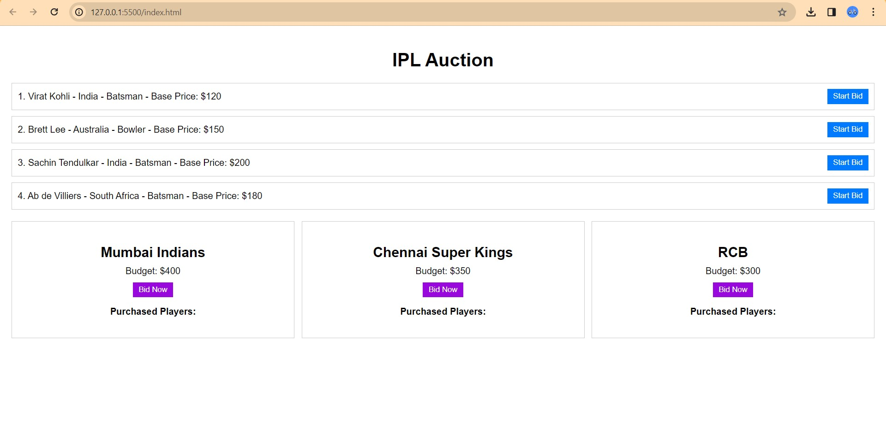
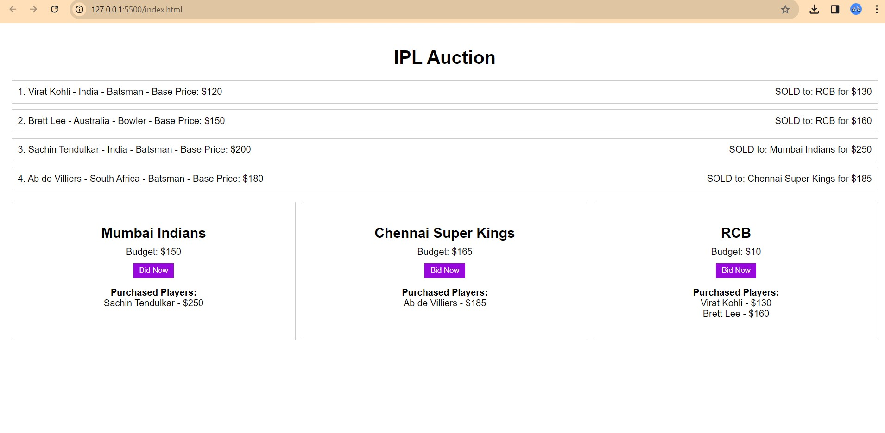

# IPL-Auction-System

<video width="320" height="240" controls>
  <source src="
https://github.com/Akash1437/IPL-Auction-System/assets/107811139/ac7b3d10-73c4-42d5-9000-fdfa47a6fe91
" type="video/mp4">

</video>

  <source src="
https://github.com/Akash1437/Ticket_Booking_System/assets/107811139/8e3931e6-950b-40ff-8bc7-ac8d86c37375
" type="video/mp4">
  
</video>
https://github.com/Akash1437/IPL-Auction-System/assets/107811139/ac7b3d10-73c4-42d5-9000-fdfa47a6fe91

 

 

# PROJECT INSIGHTS

    1. List of players from different countries with different categories like Batsman, bowler, and all-rounder.
    2. Every player will have a base price and the buyer team have to bid from the base price.
    3. Every team will have a fixed budget to buy players. They can buy N number of players within that budget.
    4. Once the budget is over for a team, they won't be able to buy any player after it.
    5. Once the bid starts for a player, then all teams can bid for that player if they want. Bidding will be open for 1 minute.
    6. There should be a SOLD button in the system, once clicked on that player will be assigned to the maximum bidder (team) and the bid amount will deduct from that team's budget.
    7. All purchased players should list under the respective team who buy them.
